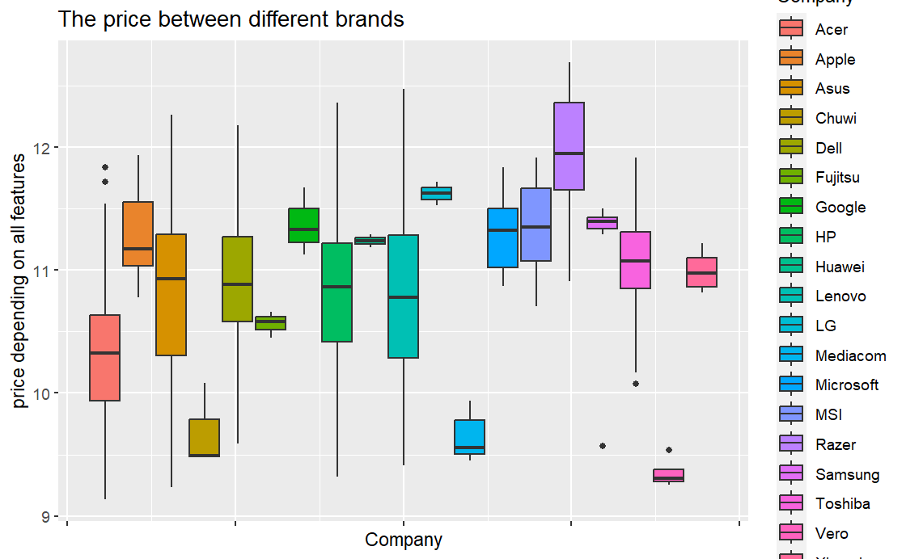

```{r install-package, include = FALSE, eval = FALSE}
# Copy and paste the following code into your console to download and install
# the `xaringan` package that contains all of the code which allows you 
# to create presentation slides in Rmarkdown
install.packages('xaringan')
```


```{r load-packages, include = FALSE}
# Add any additional packages you need to this chunk
library(tidyverse)
library(tidymodels)
library(palmerpenguins)
library(knitr)
library(xaringanthemer)
```

```{r setup, include=FALSE}
# For better figure resolution
knitr::opts_chunk$set(fig.retina = 3, dpi = 300, fig.width = 6, fig.asp = 0.618, out.width = "80%")
```

```{r load-data, include=FALSE}
# Load your data here
laptop <- read.csv("data/laptop_data_cleaned.csv") 
```

```{r include=FALSE}

#Background image
style_xaringan(
  title_slide_background_image = "img/confetti.jpg"
)
```

class: inverse, center, middle

#Data
---

-The data used by our group is about computers and includes information on thousands of laptops. This dataset features laptops from multiple brands and models with different configurations and characteristics.
```{r warning=FALSE, out.width="100%", fig.width=4, echo=FALSE}
print(laptop)
```
---
class: inverse, center, middle

# Goal
---
# Goal

--

- Study the laptop market

--

- The price gap between different brands and different kinds of laptop

--

- The impact of different hardware on the device price


---
class: inverse, center, middle

#Study the laptop market
---
```{r warning=FALSE, out.width="100%", fig.width=4, echo=FALSE}
ggplot(data = laptop, aes(y = Company)) +
  geom_bar() +
  labs(title = " the sales of brands")+
  theme(axis.text = element_text(size = 7))
```
---
```{r warning=FALSE, out.width="100%", fig.width=4, echo=FALSE}
ggplot(data = laptop, aes(y = TypeName)) +
  geom_bar() +
  labs(title = "the sales of different types")
```
---
class: center, middle

.pull-left[
```{r warning=FALSE, out.width="100%", fig.width=4, echo=FALSE}
ggplot(laptop, aes(
    x = "",
    fill = Os
    )) +
  geom_bar(position = "fill") +
  coord_polar("y", start = 0) +
  theme_void() +
  labs( title = "The market share of different systems( Os )" )
```
]

.pull-right[
```{r warning=FALSE, out.width="100%", fig.width=4, echo=FALSE}
laptop_Os <- laptop$Os %>%
  table() %>%
   as.data.frame()
laptop_Os$percentage <- laptop_Os$Freq / sum(laptop_Os$Freq) * 100
print(laptop_Os)
```
]
---
class: center, middle

.pull-left[
```{r warning=FALSE, out.width="100%", fig.width=4, echo=FALSE}
ggplot(laptop, aes(x = "", fill = Cpu_brand)) +
  geom_bar(position = "fill")+
  coord_polar("y", start = 0)+
  theme_void() +
  labs( title = "The market share of different CPU" )

```
]

.pull-right[
```{r warning=FALSE, out.width="100%", fig.width=4, echo=FALSE}
laptop_Cpu_brand <- laptop$Cpu_brand %>%
  table() %>%
  as.data.frame()
laptop_Cpu_brand$percentage <- laptop_Cpu_brand$Freq / sum(laptop_Cpu_brand$Freq) * 100
print(laptop_Cpu_brand)
```
]
---
```{r warning=FALSE, out.width="100%", fig.width=4, echo=FALSE}
ggplot(data = laptop,
       mapping = aes(y = Price,
                     fill = Cpu_brand))+
   geom_histogram(binwidth = 0.05)+
  facet_grid(~Cpu_brand)+
  theme(axis.text = element_text(size = 5), 
        axis.title = element_text(size = 10))
```
---
class: inverse, center, middle

#The price gap between different brands and different kinds of laptop
---
```{r warning=FALSE, out.width="100%", fig.width=4, echo=FALSE}

```
---
```{r warning=FALSE, out.width="100%", fig.width=4, echo=FALSE}
ggplot(data = laptop, 
       mapping = aes(y = Price,
                     fill = TypeName)) +
  geom_boxplot()+
  labs(
    x = "typename",
    y = "price depending on all features",
    title = "The price gap between different kinds of laptop")+
  theme(axis.text = element_text(size = 10),
        axis.title = element_text(size = 7),
        plot.title = element_text(size = 10))

```
---
class: inverse, center, middle

#The impact of different hardware on the device price
---
class: center, middle

.pull-left[
```{r warning=FALSE, out.width="100%", fig.width=4, echo=FALSE}
laptop %>% 
  ggplot( aes(x = Ram , y = Price))+
  geom_point()+
  geom_smooth(method = "lm", se = FALSE)

```
]

.pull-right[
```{r warning=FALSE, out.width="100%", fig.width=4, echo=FALSE}
laptop %>% 
  ggplot( aes(x = TouchScreen , y = Price))+
  geom_point()+
  geom_smooth(method = "lm", se = FALSE)

```
]
---
class: center, middle

.pull-left[
```{r warning=FALSE, out.width="100%", fig.width=4, echo=FALSE}
laptop %>% 
  ggplot( aes(x = Ips , y = Price))+
  geom_point()+
  geom_smooth(method = "lm", se = FALSE)

```
]

.pull-right[
```{r warning=FALSE, out.width="100%", fig.width=4, echo=FALSE}
laptop %>% 
  ggplot( aes(x = HDD , y = Price))+
  geom_point()+
  geom_smooth(method = "lm", se = FALSE)

```
]
---
class: center, middle

.pull-left[
```{r warning=FALSE, out.width="100%", fig.width=4, echo=FALSE}
laptop %>% 
  ggplot( aes(x = Ppi , y = Price))+
  geom_point()+
  geom_smooth(method = "lm", se = FALSE)

```
]

.pull-right[
```{r warning=FALSE, out.width="100%", fig.width=4, echo=FALSE}
linear_reg() %>%
  set_engine("lm") %>%
  fit(Price ~ Ram + Weight + TouchScreen + Ips + Ppi + HDD, data = laptop)%>%
  tidy()

```
]
---
class: inverse, center, middle

# Thank You

